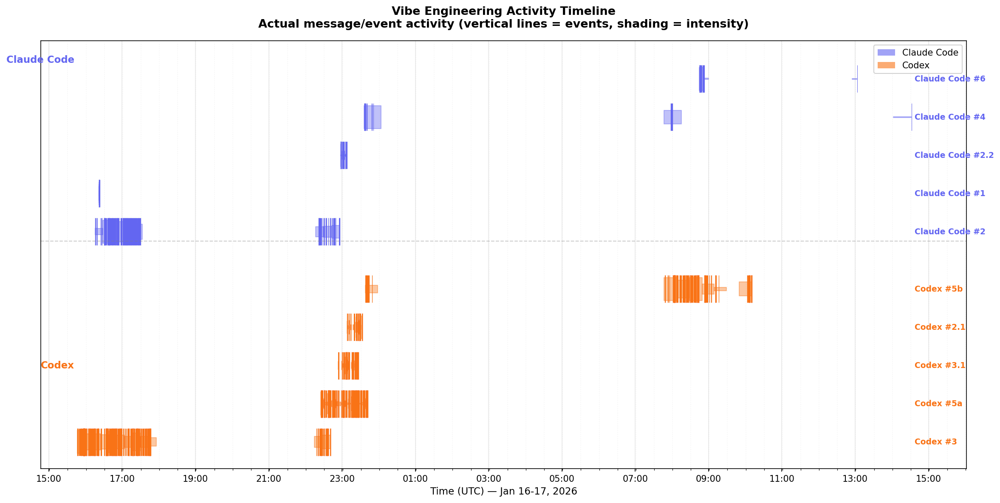

# Workflow for Jax-js-mcmc

A vibe-engineered workflow using multiple agents through design, implementation, and review phases.

---

## Design Phase

### Brainstorm with Superpowers (Claude Code)

- 2 worktrees via conductor

### [Claude Code #1](https://gisthost.github.io/?68f03be6c5d158c0276aa81356f82228/index.html) *(Jan 16, 15:47–16:14 UTC)*
- Plan mode
- Claude Code went off rails with respect to memory and refs
- Stopped and let it write a document about the issues, then restarted

### [Claude Code #2](https://gisthost.github.io/?07d34dfbff597a129485d4da89ed1211/index.html) *(Jan 16, 16:16–16:26 UTC)*
- Started to check it with the new memory doc and asked it to check `/tmp/blackjax`
- Let it do the plan, then asked it again to check on `/tmp/blackjax` when it got stuck more explicitly
- It got stuck, asked it to re-run, told it to add the deps to `.gitignore`

### [Codex #2.1](https://gistpreview.github.io/?22deee051c7926f93037cd20fc70da99/index.html) *(Jan 16, 23:08–23:33 UTC)*
- Ran `/review` against base branch `main`
- Reviewed memory/ref handling in Welford updates
- Found potential issues with slice function usage on 2D arrays
- Analyzed acceptance probability handling and step size adaptation

### [Claude Code #2.2](https://gisthost.github.io/?e36e8fccd9809e35748750aac804bfed/index.html) *(Jan 16, 22:57–23:08 UTC)*
- Ran code-simplifier on PR #4
- Extracted helper functions in leapfrog.ts, diagnostics.ts, hmc.ts
- Commit `53c3704`

### [Codex #3](https://gistpreview.github.io/?5f6b8022e4572a7a886db872d7df98fb/index.html) *(Jan 16, 15:46–22:41 UTC)*
- Let it run to check the plan from the brainstorming
- Clarifying questions
- Asked it to take suggested defaults and update the concrete design doc with that
- Told it to check `/tmp/jax-js` and check it before implementing
- It went off to create the thing
- Asked it to create a `Readme.md`
- Asked it to clone blackjax into `/tmp` for getting inspiration for more tests
- Asked it to cleanup PRs

**API/Types notes from Codex #3:**
- `logProb(params)` returns a scalar Array (0-dim) in float32; no JS number return
- `initialParams` required; `key` required; `numSamples` required
- `JsTree` = nested object/array of Array leaves; use jax-js tree utilities for map/flatten
- HMC options with defaults

### [Codex #3.1](https://gistpreview.github.io/?d039f47a6bb9d9a361a65cd6aa1204a0/index.html) *(Jan 16, 22:54–23:25 UTC)*
- Ran Codex `/review`, then fixed the found issues
- Do PR #2

---

## Review Phase

### [Claude Code #4](https://gisthost.github.io/?0916a1550e2d826af740774384b23985/index.html) *(Jan 16, 23:35 – Jan 17, 14:32 UTC)*
- Compare both PRs as Software Architect
- Created PR-COMPARISON.md
- Initially favored PR #4, revised to PR #2 after external review
- Merged PR #2, created PR4-CHERRY-PICK-PLAN.md

### [Codex #5](https://gistpreview.github.io/?fcd729f7e831fc0f70021e3e6c4c835c/index.html) *(Jan 16, 22:25–23:41 UTC)*
- Found "Codex #3" to be better
- "Claude Code #2" had breaking changes, uses arrays instead of trees
- Not reflecting the design doc

### Claude Code #4 *(continued)*
- Input from Codex #5
- Agreed, but mentioned better testing suite from "Claude Code #2"
- Suggested: take "Codex #3" and cherry-pick some improvements from "Claude Code #2"

### [Codex #5](https://gistpreview.github.io/?96f339ef48f2c1fbd33830169e129423/index.html) *(Jan 16, 23:38 – Jan 17, 10:10 UTC)*
- Passed on new suggestion from Claude Code #4
- Mostly agreed, asked it to plan/implement
- Went off to add the improvements from "Claude Code #2"
- Realized dev dependency instructions around vitest not paid attention to
- `.agents/Agents.md` not in context
- Streamlined setup / added `pnpm install` to `Agents.md`
- Loosened volume preservation tests
- `random.split` → `splitKeys`
- Checked blackjax for inspiration, added:
  1. One analytic system test (harmonic oscillator)
  2. A kinetic-energy/mass-matrix math test
  3. A multi-step trajectory check (e.g., final state near analytic after N steps)
- Pushed commit and adapted PR

### [Claude Code #6](https://gisthost.github.io/?d20590487339a9cc0937e08bc40a2457/index.html) *(Jan 17, 08:45–13:03 UTC)*
- Ran code-simplifier on PR #6
- Refactored physics test files
- Commit `b704e81`

### Codex #5
- `/review` no regrets, push and merge

---

## Timeline

```mermaid
gantt
    title Vibe Engineering Session Timeline (Jan 16-17, 2026 UTC)
    dateFormat HH:mm
    axisFormat %H:%M

    section Claude Code
    #1 Plan mode, memory docs     :cc1, 15:47, 27min
    #2 HMC impl, debugging        :cc2, 16:16, 10min
    #2.2 Code-simplifier PR#4     :cc22, 22:57, 11min
    #4 PR comparison              :cc4, 23:35, 897min
    #6 Code-simplifier PR#6       :cc6, 08:45, 258min

    section Codex
    #3 Full HMC implementation    :cx3, 15:46, 415min
    #5a Review, comparison        :cx5a, 22:25, 76min
    #3.1 Review, bug fix          :cx31, 22:54, 31min
    #2.1 ESS bugs review          :cx21, 23:08, 25min
    #5b Cherry-pick, merge        :cx5b, 23:38, 632min
```

*Note: Claude Code #4, #6 and Codex #5b times span into Jan 17. Chart shows relative durations.*

### Activity Timeline

The Gantt chart above shows session durations, but actual activity was bursty. This plot shows when messages/events actually occurred:

Key observations:
- **Codex #3** ran for 7 hours but was mostly idle in the middle (waiting for user input)
- **Late-night cluster** (22:00-00:00): intense parallel activity across multiple sessions
- **Morning wrap-up** (08:00-10:00): Codex #5b and Claude Code #6 finishing work

---

## Transcripts

Published session transcripts for reference.

### Claude Code Sessions

| Session | Description | Transcript |
|---------|-------------|------------|
| Claude Code #1 | Plan mode, memory/refs issues, JAX-JS-MEMORY.md (Lyon) | [gist](https://gisthost.github.io/?68f03be6c5d158c0276aa81356f82228/index.html) |
| Claude Code #2 | HMC implementation, debugging memory/move semantics (Kyoto) | [gist](https://gisthost.github.io/?07d34dfbff597a129485d4da89ed1211/index.html) |
| Claude Code #2.2 | Code-simplifier on PR #4 (Jan 16, 22:57 UTC) | [gist](https://gisthost.github.io/?e36e8fccd9809e35748750aac804bfed/index.html) |
| Claude Code #4 | PR comparison, PR-COMPARISON.md (Jan 16, 23:35 UTC) | [gist](https://gisthost.github.io/?0916a1550e2d826af740774384b23985/index.html) |
| Claude Code #6 | Code-simplifier on PR #6 (Jan 17, 08:45 UTC) | [gist](https://gisthost.github.io/?d20590487339a9cc0937e08bc40a2457/index.html) |

### Codex Sessions

| Session | Description | Transcript |
|---------|-------------|------------|
| Codex #2.1 | Review ESS bugs, fix normalization and chain handling | [gist](https://gistpreview.github.io/?22deee051c7926f93037cd20fc70da99/index.html) |
| Codex #3 | Full HMC implementation with design review, tests, PR consolidation | [gist](https://gistpreview.github.io/?5f6b8022e4572a7a886db872d7df98fb/index.html) |
| Codex #3.1 (a) | Mass matrix timing bug fix, step-size retuning | [gist](https://gistpreview.github.io/?d039f47a6bb9d9a361a65cd6aa1204a0/index.html) |
| Codex #3.1 (b) | PR #2 code review, mass matrix adaptation analysis | [gist](https://gistpreview.github.io/?98c9907b74907a71996874661dc425fe/index.html) |
| Codex #5 (a) | TDD strategy, BlackJAX integration, implementation | [gist](https://gistpreview.github.io/?fcd729f7e831fc0f70021e3e6c4c835c/index.html) |
| Codex #5 (b) | PR comparison, cherry-picking, test expansion, merge | [gist](https://gistpreview.github.io/?96f339ef48f2c1fbd33830169e129423/index.html) |
