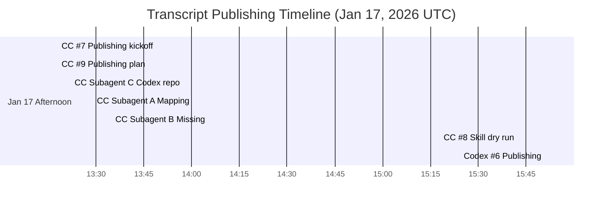
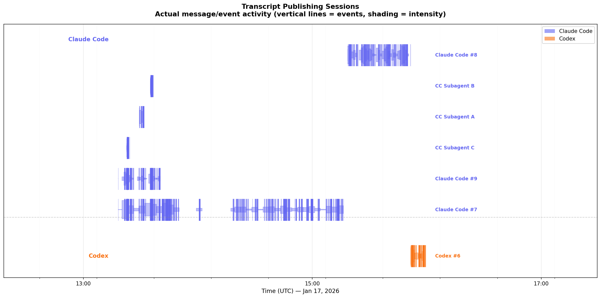

# Workflow for Jax-js-mcmc Transcript Publishing

This addendum documents the transcript-publishing sessions that followed the main multi-agent build.

---

## Documentation Phase

### [Claude Code #7](https://gisthost.github.io/?5f04cc41362b0cc11a6b17bc7bd9aa52/index.html) *(Jan 17, 13:18–15:16 UTC)*
- Kickoff to publish transcripts and review the existing workflow doc
- Cloned `codex-transcripts` and searched for the correct `claude-code-transcripts` repo
- Spawned subagents to map sessions and inspect tooling

### [Claude Code #9](https://gisthost.github.io/?4723d5658751fca310799afba8a0c4de/index.html) *(Jan 17, 13:18–13:40 UTC)*
- Drafted the publishing plan and mapped target sessions
- Coordinated subagents to locate missing workflow entries
- Summarized expected gist count and update steps

### [Claude Code Subagent A](https://gisthost.github.io/?a7a3d0d20303d408f0bf3ac4c54fd4a7/index.html) *(Jan 17, 13:29–13:31 UTC)*
- Mapped workflow session numbers to transcript files

### [Claude Code Subagent B](https://gisthost.github.io/?276bf9c9efa66b162635722c64611762/index.html) *(Jan 17, 13:35–13:36 UTC)*
- Identified missing sessions for Codex #2.1/#3 and Claude Code #1

### [Claude Code Subagent C](https://gisthost.github.io/?5537b8eb462ee979f671c5adf263d955/index.html) *(Jan 17, 13:22–13:24 UTC)*
- Explored the `codex-transcripts` repo structure and docs

### [Claude Code #8](https://gisthost.github.io/?cc35270b09fe529772bff0b6bfa9a11e/index.html) *(Jan 17, 15:18–15:51 UTC)*
- Ran the vibe-engineering-workflow command as a dry run (`test-workflow.md`)
- Captured embedded skill instructions for reference

### [Codex #6](https://gistpreview.github.io/?759db350b333c454164d5a19c6792106/index.html) *(Jan 17, 15:51–15:56 UTC)*
- Executed the Codex-side publishing steps and documentation output

Notes:
- Supporting subagents not published (short runs): `agent-aab2a17` (session discovery), `agent-afbd0bc` (claude-code-transcripts exploration), `agent-aef33c5` (skill dry run)

---

## Timeline

### Activity Timeline

---

## Transcripts

### Claude Code Sessions

| Session | Description | Transcript |
|---------|-------------|------------|
| Claude Code #7 | Transcript publishing kickoff and tool discovery | [gist](https://gisthost.github.io/?5f04cc41362b0cc11a6b17bc7bd9aa52/index.html) |
| Claude Code #8 | Vibe workflow dry run (`test-workflow.md`) | [gist](https://gisthost.github.io/?cc35270b09fe529772bff0b6bfa9a11e/index.html) |
| Claude Code #9 | Publishing plan and session mapping | [gist](https://gisthost.github.io/?4723d5658751fca310799afba8a0c4de/index.html) |
| CC Subagent A | Map workflow sessions to transcript files | [gist](https://gisthost.github.io/?a7a3d0d20303d408f0bf3ac4c54fd4a7/index.html) |
| CC Subagent B | Find missing workflow sessions | [gist](https://gisthost.github.io/?276bf9c9efa66b162635722c64611762/index.html) |
| CC Subagent C | Explore codex-transcripts repo | [gist](https://gisthost.github.io/?5537b8eb462ee979f671c5adf263d955/index.html) |

### Codex Sessions

| Session | Description | Transcript |
|---------|-------------|------------|
| Codex #6 | Publishing and documentation output | [gist](https://gistpreview.github.io/?759db350b333c454164d5a19c6792106/index.html) |
